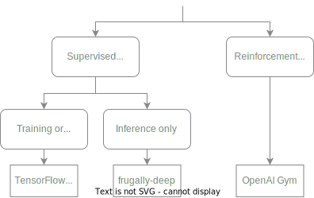

# Machine Learning in OMNeT++

This repository contains materials on how to use Machine Learning (ML) frameworks in OMNeT++.

## Methods
There are different methods to perform ML in OMNeT++.
The figure below gives an overview of the ones that are described in this repository.

	

### TensorFlow C++ API
[TensorFlow](https://www.tensorflow.org/) can be used directly in OMNeT++ by using its [C++ API](https://www.tensorflow.org/api_docs/cc).
An untrained or trained neural network can be created in Python, exported and used in an OMNeT++ simulation.
As TensorFlow needs to be built from source to get access to the C++ API, we provide Docker images with TensorFlow and OMNeT++ preinstalled.
While this method offers high performance and control, it also requires sound knowledge in ML and TensorFlow.

More information can be found here:
 * [Documentation](docs/tensorflow.md)
 * [Examples](examples/tensorflow)
 * [Docker Images](https://github.com/ComNetsHH/omnetpp-ml_dockerfiles)

### frugally-deep
[frugally-deep](https://github.com/Dobiasd/frugally-deep) is a header-only library for performing inference on Keras models in C++.
Compared to the TensorFlow C++ API, it is much easier to compile and integrate into an OMNeT++ simulation, but is limited in functionality by not supporting GPU computing or training.

More information can be found here:
 * [Documentation](docs/frugally-deep.md)
 * [Examples](examples/frugally-deep)

### OpenAI Gym
OMNeT++ can be wrapped in an [OpenAI Gym](https://www.gymlibrary.dev) to use an OMNeT++ simulation as an environment for Reinforcement Learning (RL) in Python.
This is achieved by using [Veins-Gym](https://www2.tkn.tu-berlin.de/software/veins-gym), which unlike its name suggests works with any OMNeT++ simulation.
The use of the standardized OpenAI Gym environment interface makes this approach usable with many popular RL frameworks such as [Stable Baselines](https://stable-baselines.readthedocs.io) or [RLlib](https://docs.ray.io/en/latest/rllib).
Therefore, this method is recommended for anyone who wants to implement RL problems in OMNeT++.

More information can be found here:
 * [Documentation](docs/openai_gym.md)
 * [Examples](examples/openai_gym)

## Authors
 * [Daniel Stolpmann](https://github.com/dstolpmann), Hamburg University of Technology, Institute of Communication Networks, Germany - <daniel.stolpmann@tuhh.de>
